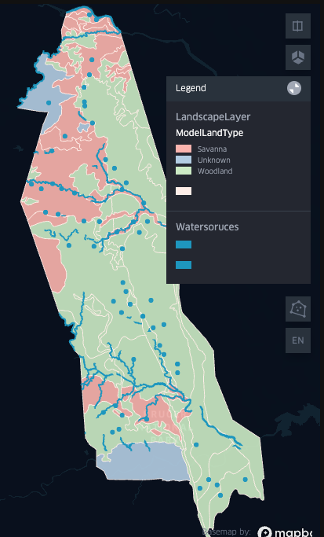
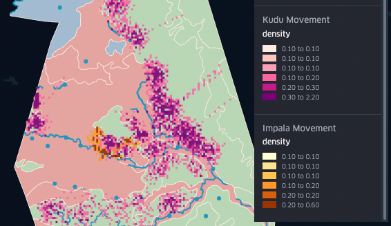
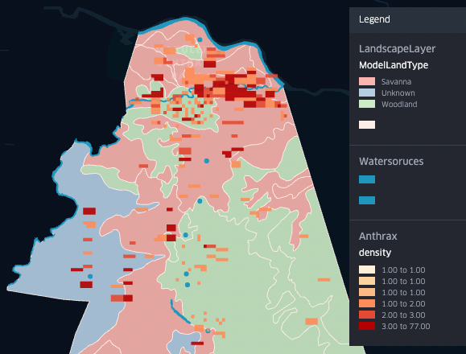

# KNP Anthrax Model

This configurable agent-based model simulates movement patterns and behaviors of spatially explicit Kudus and Impalas in a georeferenced environment (by default, the northern half of the Kruger National Park (KNP)) to enable analysis of the distribution and density of Anthrax pathogens. The model runs on the [Multi-Agent Research and Simulation (MARS) Framework](https://mars-group-haw.github.io/index.html).

| Simulation area: Northern KNP                  | Kudu and Impala movement density                                  | Anthrax infection site density                                                      |
| ---------------------------------------------- | ------------------------------------------------------------ | ---------------------------------------------- |
|  |  |                           |

## Project Setup and Usage

There are two options for setting up and using the project. **Option 1** allows you to see and change the source code as well as configure and run the model. **Option 2** allows you to only configure and run the model without being able to see or change the source code.

### Option 1: Source Code

1. Install the [.NET SDK 6.0](https://dotnet.microsoft.com/en-us/download), either manually or within an interactive development environment (IDE) like [JetBrains Rider](https://www.jetbrains.com/de-de/rider/).
2. Copy the project from GitHub to your machine in one of the following ways:
   - Clone the project by entering the command `git clone https://github.com/MARS-Group-HAW/knp-anthrax-model.git` (**Note:** to do this, you must have [Git](https://git-scm.com/downloads) installed).
   - Download the project by clicking the "Code" button and selecting "Download ZIP".
3. Configure the model as needed (see [Configuration](#configuration) section below).
4. Build and run the project in one of the following ways:
   - In a terminal:
     1. Open a terminal and navigate to the folder `KNPAnthrax/`.
     3. Build the project by entering the command `dotnet build`.
     4. Run the project by enter the command `dotnet run`.
   - In the Rider IDE:
     1. Open Rider and open the solution file `KNPAnthrax.sln`. This opens the project in Rider.
     2. Press the "Run"-Button in the top-right area of the window.

### Option 2: Executable

Use a self-contained and executable [simulation box](https://github.com/MARS-Group-HAW/knp-anthrax-model/releases) to configure and run the model.

1. At the above link, download the box that fits your operating system.
2. Unzip the box.
3. Configure the model as needed (see [Configuration](#configuration) section below).
3. Run the `KNPAnthrax` executable.

## Configuration

To configure the model components (global simulation variables, agents, and layers), change the values in the file `config.json`, which is located in the folder `KNPAnthrax`. The most important configuration options are described below.

### Global simulation parameters

Simulation start and end time:
- `startPoint` specifies the start time
- `endPoint` specifies the end time

Tick lenght: 8 hours
- `deltaT` specifies the number
- `detlaTUnit` specifies the unit

### Agent parameters

Each agent starts with a given `Energy` property. During each tick, the value of `Energy` decreases by `1`.
- While the `Energy` value is greater than or equal to `15`, the agent will randomly walk arround while obeying certain constraints (landtype preference and proximity to water source).
- When the `Energy` value is below `15`, the agent begins to search for and move to the nearest water source. Upon reaching a water source, the agent drinks and stays there until `Energy` is at `100`.

#### `Kudu`

Preferred landscape type: Woodland

| Key name                                                   | Value type and value range                             | Comment                                                      |
| ------------------------------------------------------------ | ---------------------------------------------------- | ------------------------------------------------------------ |
| `count`                                                      | `int`, at least `0`                                  | Number of agents, ⚠️ in the file `Resources/impala.csv`, you need the same number of rows. |
| `SpawnMinEnergy`, `SpawnMaxEnergy`                           | `int`, between `0` and `100`                         | Defines a range in which the `Energy` of each agent will be at spawning. This allows for more dynamic animal behaviour, so that not all animals need water at the exact same time. |
| `SpawnWoodlandProbability`, `SpawnSavannaProbability`        | `float`, each between `0.0` and `1.0`, sum needs to be `1.0` | Probability of thes agents spawning in Woodland or Savanna land type.       |
| `MinMovementPerTickInM`, `MaxMovementPerTickInM`             | `int`, in meters                                     | Distance in meters that the agent moves per tick will be between these values. |
| `MovementOnWoodland`                                         | `float`, between `0.0` to `1.0`, sum needs to be `1.0`                                               | Currently has no effect, since the Kudu prefers Woodland                |
| `MovementOnSavanna`                                          | `float`, between `0.0` to `1.0`, sum needs to be `1.0`                                               | If the agent reaches a Savanna patch, it will continue to walk on it with this probability. |
| `MaxDistanceFromWaterInM`                                    | `int` in meters                                      | Maximum distance the agent will move away from the nearest water source. |
| `AnthraxInfectionProbability`                                | `float`, between `0.0` and `1.0`                                              | This probability is multiplied with values from the `AnthraxLayer` grid cells to determine whether the agent becomes infected. |
| `MinInfectionDurationInTicks`, `MaxInfectionDurationInTicks` | `int`, in number of ticks                            | Range of number of ticks that an infected agent will leave a trace on the `AnthraxLayer` (a trace represents a new Anthrax infection site caused by a dead animal). |
| `OutputAgentTrack`                                           | `bool`                                               | If set to `true`, each agent produces a single GeoJSON file containing its movement trajectory throughout the simulation. |

#### `Impala`

Preferred landscape types: Woodland, Savanna

| Key name                                                   | Value type and value range                                                | Comment                                                      |
| ------------------------------------------------------------ | ---------------------------------------------------- | ------------------------------------------------------------ |
| `count`                                                      | `int`, at least `0`                                  | Number of agents, ⚠️ in the file `Resources/impala.csv`, you need the same number of rows. |
| `SpawnMinEnergy`, `SpawnMaxEnergy`                           | `int`, between `0` and `100`                         | Defines a range in which the `Energy` of each agent will be at spawning. This allows for more dynamic animal behaviour, so that not all animals need water at the exact same time. |
| `SpawnWoodlandProbability`, `SpawnSavannaProbability`        | `float`, each between `0.0` and `1.0`, sum needs to be `1.0` | Probability of thes agents spawning in Woodland or Savanna land type.       |
| `MinMovementPerTickInM`, `MaxMovementPerTickInM`             | `int`, in meters                                     | Distance in meters that the agent moves per tick will be between these values. |
| ⚠️ no Woodland/Savanna                                       | --                                                   | No options are given due to the near-equal disitribution (60%-40%).    |
| `MaxDistanceFromWaterInM`                                    | `int` in meters                                      | Maximum distance the agent will move away from the nearest water source. |
| `AnthraxInfectionProbability`                                | `float`, between `0.0` and `1.0`                     | This probability is multiplied with values from the `AnthraxLayer` grid cells to determine whether the agent becomes infected. |
| `MinInfectionDurationInTicks`, `MaxInfectionDurationInTicks` | `int`, in number of ticks                            | Range of number of ticks that an infected agent will leave a trace on the `AnthraxLayer` (a trace represents a new Anthrax infection site caused by a dead animal). |
| `OutputAgentTrack`                                           | `bool`                                               | If set to `true`, each agent produces a single GeoJSON file containing its movement trajectory throughout the simulation. |

### Layer parameters

#### `LandscapeLayer`

Provides landtype classification. Input data are manually mapped to `Woodland` and `Savanna` categories.

#### `Perimeter`

Simulation area, derived from union of landscape layer input.

#### `WaterLayer`

Waterholes and rivers, derived from various water data sources. The GeoJSON file can contain POINTs and LINESTRINGs.

> **Warning**
>
> All geometries given in the `WaterLayer` **must** be inside the `Perimeter` shape, or the simulation will break.

#### `AnthraxLayer`

Raster data with 1x1km resolution containing Anthrax carcass sites from the northern half of the KNP.

## Outputs

Depending on how you are using the project (see the section [Project Setup and Usage](#project-setup-and-usage) above), there are two ways to analyze and visualize results.

### Option 1

When running the project via a terminal or from within the Rider IDE (see the section [Option 1](#option-1-source-code) above), output files will be placed in the folder `KNPAnthrax/bin/Debug/net6.0/`. These output files can be visualized with [kepler.gl](https://kepler.gl) via drag-and-drop.

- `Kudu_trips.geojson` and `Impala_trips.geojson` contain time series movement data of each agent type.
  - **Note:** Due to the 8h time resulation and the corresponding large movement distances per tick, kepler.gl is unable to visualize the movement well.
- `LandscapeLayer_types.geojson` contains the mapping of the input land type file to the repsective landtype in the model (Woodland, Savanna).
- `AnthraxLayer_Start.geojson` is the input raster data of the Anthrax distriubtion (the input ASC/GeoTIFF converted to GeoJSON).
- `AnthraxLayer_End.geojson` is a heatmap showing the anthrax densitiy after all animals have left their traces.
- `KuduMovement.geojson` and `ImpalaMovement.geojson` are heatmaps showing the movement densities of all agents. Each agent increments the value of the cell in which it stands by `0.1`.

**Note:** [kepler.gl](https://kepler.gl/) does not enable saving configurations or visualizations. For convenience, you can also use the provided Jupyter Notebook (see the folder `Analysis/`) with a preset configuration to load some data. To do so, start a [Docker Container](https://www.docker.com/products/docker-desktop/) within which the Jupyter Hub will run. To start the Docker container, follow these steps:
1. Install and start Docker Desktop.
2. Open a terminal and navigate to the folder `Analysis/`.
3. Start the Docker container by entering one of the following commands:
   - For Mac: `./notebookdocker.sh`
   - For Windows: `./notebookdocker.bat`
3. In your internet browser, enter `localhost:8888` in your address bar.
4. Open and run the Jupyter notebook `Analysis.ipynb`. The kepler.gl configurations will be stored in the file `map_config.py` for later use.

### Option 2

When using one of the executable boxes (see the section [Option 2](#option-2-executable) above), the output files will be located in the same folder as the `KNPAnthrax` executable file.
